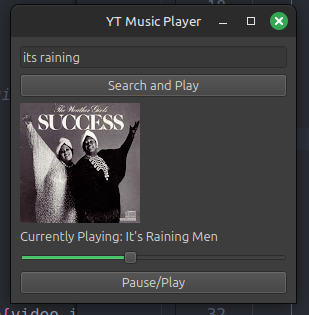

    

    
## Tech Stack
### 1. Programming Language:

    Python – Simple, widely supported, and has great libraries for UI and web scraping.

### 2. GUI Frameworks 

    PyQt6 – Feature-rich, modern look, supports multimedia playback.

### 3. Web Scraping & API Handling

    ytmusicapi – API wrapper for YouTube Music (easier than scraping manually)

### 4. Audio Streaming

    yt-dlp – A fork of youtube-dl, allows fetching and playing YouTube Music audio streams.
    FFmpeg / VLC Python Bindings – To decode and play audio.

## Project Breakdown

    Set up GUI with PyQt6 or PySide6 – Create a simple UI with a search bar, play/pause buttons.
    Use ytmusicapi to fetch YouTube Music data – Get song metadata, URLs, and thumbnails.
    Use yt-dlp to fetch and stream audio – Extract direct audio URLs and play using FFmpeg or VLC.
    Integrate playback controls – Play/pause